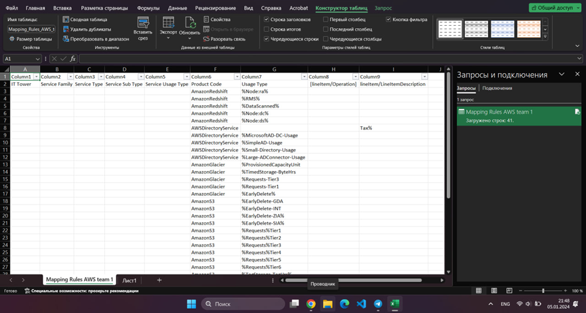
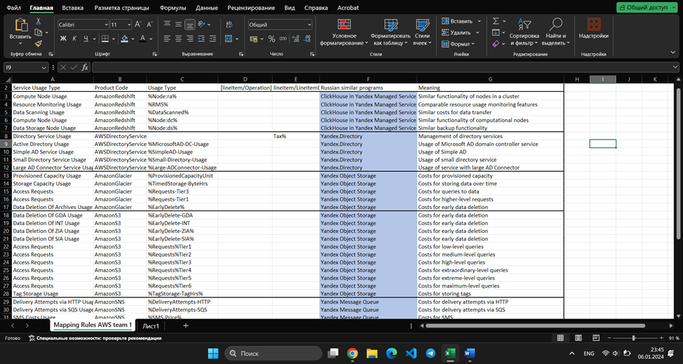

## Analytical work 1

### Team members
Kirollos Mamdouh Eskander Rezkallah, Mustafa Abdalla Mohamed Ahmed Abdalla

### Purpose of work

Acquaintance with cloud services. Understanding the layers of abstraction over infrastructure in the cloud. Forming an understanding of the types of service consumption in the service model. Comparison of services between different providers. Assessing the possibilities of migration to domestic services.

### Given
A snapshot of billing data from the provider after a little processing in the form of SQL parameters. The % symbol at the beginning/end means that any set of characters can appear before/after it. And also Google with provider documentation

**Amazon Redshift** is a cloud-based Data Warehouse. Used for storing and analyzing large amounts of data. Allows you to analyze data using SQL and BI tools. Resources are automatically provisioned and scaled, and there are no charges for unused resources. Based on PostgreSQL. 

**AWS Directory Service** is a service that provides directory and identity management, providing the ability to control user access and permissions to AWS resources and applications. The service is designed for integration with corporate directories (Microsoft Active Directory or LDAP). Provides convenient administration

**Amazon Glacier** is a low-cost, long-term, reliable, and secure service for storing data that is not used for long periods of time (data archiving). Allows you to store data as cheaply as possible at the lowest price.

**Amazon S3 (Amazon Simple Storage Service)** is an object storage service that provides high performance, reliability, and scalability for data storage and protection. It also allows users to store and retrieve any amount of data at any time from anywhere on the Internet. Data can be accessed through the API or the AWS console. There are different types of storage available, varying in price and availability.

**Amazon SNS** SNS is a service that allows you to create and manage notifications using two methods for sending messages. A2A provides high-throughput push notifications between distributed systems, microservices, and serverless applications. A2P provides delivery of messages in the form of SMS, email and push notifications.

**Amazon translate** is a machine translation service that provides fast, high-quality, affordable, customizable translation from one language to another. Allows you to translate texts and speech. It is an option for automating language translation using a deep learning model.

**Amazon transcribe** is an automatic speech recognition service. Provides the ability to automatically translate audio into text. Uses advanced machine learning technologies to recognize speech and convert it to text, allowing it to efficiently process large volumes of audio data.

**AWSCodePipeline** is a fully managed continuous delivery service that helps automate release pipelines to quickly and reliably update applications and infrastructure.

**CodeBuild**  is a fully managed continuous integration service that compiles source code, performs testing, and produces ready-to-deploy software packages. It can integrate with other code versioning services and tools to create flexible and scalable continuous delivery workflows, and supports multiple programming languages, runtimes, and build tools, providing powerful application build automation capabilities.
как часть Ci/Cd

**Amazon ML** is a managed machine learning service that helps you build powerful models. Amazon ML gives you the power of machine learning without requiring any experience with machine learning algorithms or techniques.

**Amazon Polly** is a cloud-based service that converts text into live speech. Use dozens of natural-sounding Amazon Polly voices in many languages to create speech-enabled apps. It can be used to create applications that increase user engagement through the generation of natural-sounding audio content.

### Analogs

Amazon Redshift - Yandex Query

1)	Amazon Redshift - ClickHouse in Yandex Managed Service
2)	AWS Directory Service - Yandex.Directory
3)	Amazon Glacier – Yandex Object Storage
4)	Amazon S3 – Yandex Object Storage
5)	Amazon SNS – Yandex Message Queue
6)	Amazon Translate – Yandex.Translate
7)	Amazon Transcribe – Yandex SpeechKit
8)	AWSCodePipeline – no
9)	CodeBuild – no
10)	AmazonML – Yandex DataSphere
11)	AmazonPolly – Yandex SpeechKit

### Table

| Service Usage Type                                                                                       | Product Code        | Usage Type               | [lineItem/Operation] | lineItem/LineItemDescription |   |   | Russian similar programs          | Meaning  |
|----------------------------------------------------------------------------------------------------------|---------------------|--------------------------|----------------------|------------------------------|---|---|-----------------------|---|
| Compute Node Usage                                                                 | AmazonRedshift      | %Node:ra%                |                      |                              |   |   | ClickHouse in Yandex Managed Service          | Similar functionality of nodes in a cluster  |
| Resource Monitoring Usage | AmazonRedshift      | %RMS%                    |                      |                              |   |   | ClickHouse in Yandex Managed Service         | Comparable resource usage monitoring features |
| Data Scanning Usage                                                                                         | AmazonRedshift      | %DataScanned%            |                      |                              |   |   | ClickHouse in Yandex Managed Service | Similar costs for data transfer  |
| Compute Node Usage | AmazonRedshift  |   %Node:dc%                |                      |                              |   |   | ClickHouse in Yandex Managed Service | Similar functionality of computational nodes  |
| Data Storage Node Usage | AmazonRedshift      |%Node:ds%                |                      |                              |   |   | ClickHouse in Yandex Managed Service | Similar backup functionality |
| Directory Service Usage | AWSDirectoryService |                          |                      | Tax%                         |   |   | Yandex.Directory |Management of directory services   |
| Active Directory Usage | AWSDirectoryService | %MicrosoftAD-DC-Usage    |                      |                              |   |   | Yandex.Directory |Usage of Microsoft AD domain controller service |
| Simple AD Service Usage | AWSDirectoryService | %SimpleAD-Usage          |                      |                              |   |   | Yandex.Directory | Usage of Simple AD  |
| Small Directory Service Usage | AWSDirectoryService | %Small-Directory-Usage   |                      |                              |   |   | Yandex.Directory                  | Usage of small directory service |
| Large AD Connector Service Usage | AWSDirectoryService | %Large-ADConnector-Usage |                      |                              |   |   | Yandex.Directory | Usage of service with large AD Connector |
| Provisioned capacity units                                                                               | AmazonGlacier       | %ProvisionedCapacityUnit |                      |                              |   |   | Yandex Object Storage | Costs for provisioned capacity  |
| Storage Capacity Usage | AmazonGlacier       | %TimedStorage-ByteHrs    |                      |                              |   |   | Yandex Object Storage | Costs for storing data over time   |
| Access Requests                                                        | AmazonGlacier       | %Requests-Tier3          |                      |                              |   |   | Yandex Object Storage | Costs for queries to data  |
| Access Requests                               | AmazonGlacier       | %Requests-Tier1          |                      |                              |   |   | Yandex Object Storage | Costs for higher-level requests  |
| Data Deletion Of Archives Usage                          | AmazonGlacier       | %EarlyDelete%            |                      |                              |   |   | Yandex Object Storage |Costs for early data deletion   |
| Data Deletion Of GDA Usage | AmazonS3            | %EarlyDelete-GDA         |                      |                              |   |   | Yandex Object Storage |Costs for early data deletion   |
| Data Deletion Of INT Usage                           | AmazonS3            | %EarlyDelete-INT         |                      |                              |   |   | Yandex Object Storage | Costs for early data deletion  |
| Data Deletion Of ZIA Usage              | AmazonS3            | %EarlyDelete-ZIA%        |                      |                              |   |   | Yandex Object Storage | Costs for early data deletion  |
| Data Deletion Of SIA Usage          | AmazonS3            | %EarlyDelete-SIA%        |                      |                              |   |   | Yandex Object Storage | Costs for early data deletion   |
| Access Requests                                                                        | AmazonS3            | %Requests%Tier1          |                      |                              |   |   | Yandex Object Storage |Costs for low-level queries   |
| Access Requests                                                                                    | AmazonS3            | %Requests%Tier2          |                      |                              |   |   | Yandex Object Storage | Costs for medium-level queries |
| Access Requests                                                                                         | AmazonS3            | %Requests%Tier3          |                      |                              |   |   | Yandex Object Storage | Costs for high-level queries |
| Access Requests                                                                                     | AmazonS3            | %Requests%Tier4          |                      |                              |   |   | Yandex Object Storage |Costs for extraordinary-level queries   |
| Access Requests                                                                                    | AmazonS3            | %Requests%Tier5          |                      |                              |   |   | Yandex Object Storage |Costs for extreme-level queries   |
| Access Requests                                                                               | AmazonS3            | %Requests%Tier6          |                      |                              |   |   | Yandex Object Storage | Costs for maximum-level queries  |
| Tag Storage Usage                                                               | AmazonS3            | %TagStorage-TagHrs%      |                      |                              |   |   | Yandex Object Storage |Costs for storing tags   |
| Delivery Attempts via HTTP Usage                                                                                        | AmazonSNS           | %DeliveryAttempts-HTTP   |                      |                              |   |   | Yandex Message Queue                  |Costs for delivery attempts via HTTP   |
| Delivery Attempts via SQS Usage                                                                                         | AmazonSNS           | %DeliveryAttempts-SQS    |                      |                              |   |   | Yandex Message Queue                  | Costs for delivery attempts via SQS  |
| SMS Costs Usage                                                                                            | AmazonSNS           | %SMS-Price%              |                      |                              |   |   | Yandex Message Queue                  | Costs for SMS  |
| Sent SMS Usage                                                                                      | AmazonSNS           | %SMS-Sent%               |                      |                              |   |   | Yandex Message Queue                  | Number of sent SMS  |
| APNS Messages Delivery Attempts                                                                                         | AmazonSNS           | %DeliveryAttempts-APNS%  |                      |                              |   |   | Yandex Message Queue                  | Costs for delivery attempts via APNS  |
| Text Translation                                                                                          | translate           | %TranslateText           |                      |                              |   |   | Yandex.Translate      | Text transformation using machine translation  |
| Streaming Audio Transcription                                                                                          | transcribe          | %StreamingAudio          | %StreamingAudio      |                              |   |   | Yandex SpeechKit      |Transcription of streaming audio   |
| Audio Transcription                                                                                       | transcribe          | %TranscribeAudio         | TranscribeAudio      |                              |   |   | Yandex SpeechKit      | Audio transcription  |
| AWS CodePipeline Usage                                                                                                      | AWSCodePipeline     |                          |                      | Tax%                         |   |   |                       |   |
| Expiremental Pipeline                                                                                          | AWSCodePipeline     | %trialPipeline%          |                      |                              |   |   |                   |   |
| AWS CodeBuild Usage                                                                                         | CodeBuilde          |                          |                      |                              |   |   |                       |   |
| Work With Models                                                                          | AmazonML            | %AMLBoxUsage             | TrainModel           |                              |   |   | Yandex DataSphere     |Usage of computational resources for machine learning   |
| Work With Models                                                                        | AmazonML            | %AMLBoxUsage             | EvaluateModel        |                              |   |   | Yandex DataSphere     | Usage of computational resources for machine learning  |
| Audio Synthesis                                                                                       | AmazonPolly         |                          |                      |                              |   |   |     |   |

### Conclusion 
The goal of the work was achieved. During the laboratory work, AWS services were analyzed and their Russian-made analogues were found. Information about the functionality of the services was taken from the official documentation and used to fill out the table. Yandex's services are similar in many ways to Amazon and have almost the same functionality.