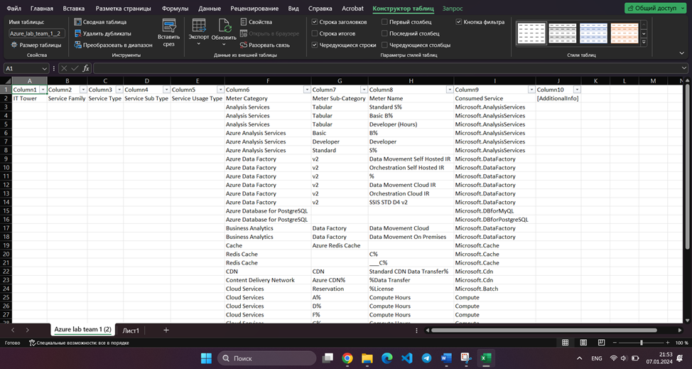
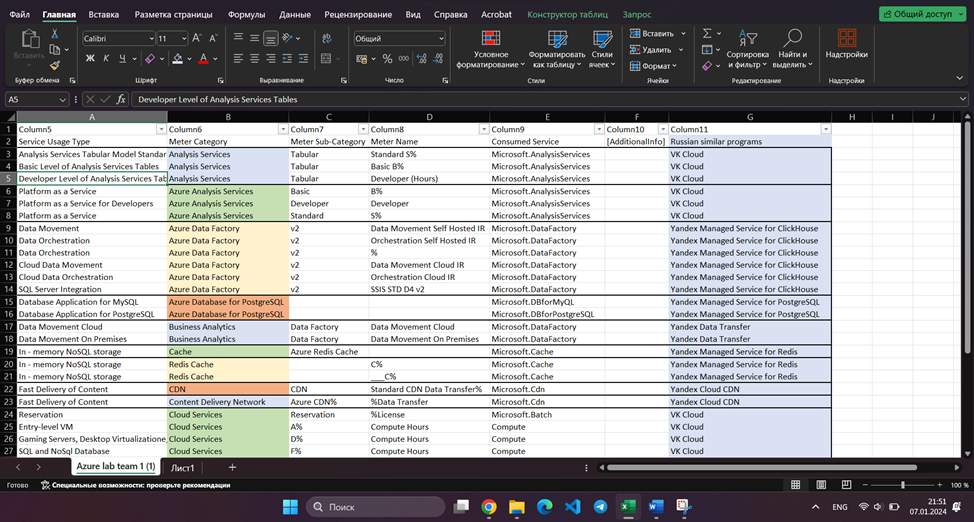

## Analytical work 2

### Team members
Kirollos Mamdouh Eskander Rezkallah, Mustafa Abdalla Mohamed AhmedAbdalla

### Purpose of work

Acquaintance with cloud services. Understanding the layers of abstraction over infrastructure in the cloud. Forming an understanding of the types of service consumption in the service model. Comparison of services between different providers. Assessing the possibilities of migration to domestic services.

### Given

A snapshot of billing data from the provider after a little processing in the form of SQL parameters. The % symbol at the beginning/end means that any set of characters can appear before/after it. And also Google with provider documentation.

### Список сервисов и их описание

**Azure Analysis Services** is a managed service that allows you to create scalable data models for analysis and reporting. It provides enterprise-grade semantic data model capabilities for business intelligence (BI), data analytics, and reporting such as Power BI, Excel, Reporting Services, and other data visualization tools.
**Azure Data Factory** is a cloud service that allows you to integrate and transform data from various sources. This service provides a no-code user interface for intuitive development with the ability to monitor and manage from a single pane of glass.
**Azure Database for PostgreSQL** is a relational database service based on the open-source PostgreSQL DBMS. It is a fully managed database service that provides high performance, security, and scalability.
**Business Analytics** is a fully managed platform for data modeling, data analysis, and reporting. It provides capabilities for integrating large amounts of data from various sources, conducting data analysis using various methods and tools, such as machine learning, statistical analysis, data visualization and others.
**Azure Redis Cache** is a managed caching service, based on the open source Redis code, which improves application performance by caching data in RAM.
**Content Delivery Network** is a service designed to efficiently deliver content that provides fast and reliable access to website or application content, improving performance and reducing latency for end users around the world. A CDN stores cached content on edge servers at point of presence locations close to end users to minimize latency.
**Cloud Services** is a cloud computing platform that provides the ability to deploy, scale and manage applications on cloud infrastructure, offering capabilities for managing virtual machines, containers, server applications and many other cloud resources.
**Data Box** is a series of devices and solutions designed to simplify and speed up the process of transferring large amounts of data between on-premises infrastructure and Azure cloud services. Azure Data Box secure storage ensures secure data transfer.
**Key Vault** is a service that provides secure storage of tokens, passwords, certificates, API keys and other sensitive information with strict access control. This service allows you to easily create and control the encryption keys used to encrypt your data.
**Scheduler** is a cloud-based task scheduling service that allows you to run various scheduled tasks. This service provides the ability to automate tasks and processes in the Azure cloud, allowing you to streamline workflows and simplify application management. Fully retired on January 31, 2022 and replaced by Azure Logic Apps.
**Sentinel** is a cloud-based security platform that provides security monitoring, threat detection, and incident response capabilities using AI and ML.

## Analogs
1)	Azure Analysis Services - VK Cloud
2)	Azure Data Factory - Yandex Managed Service for ClickHouse
3)	Azure Database for PostgreSQL - Yandex Managed Service for PostgreSQL
4)	Business Analytics - Yandex Data Transfer
5)	Azure Redis Cache - Yandex Managed Service for Redis
6)	Content Delivery Network - Yandex Cloud CDN
7)	Cloud Services - VK Cloud
8)	Data Box - Yandex Data Transfer
9)	Key Vault - Yandex Key Management Service
10)	Scheduler - Yandex Tracker
11)	Sentinel - Yandex Cloud DNS

### Table

| Service Usage Type                                | Meter Category                | Meter Sub-Category        | Meter Name                   | Consumed Service              | Russian similar programs | Additional info |
|---------------------------------------------------|-------------------------------|---------------------------|------------------------------|-------------------------------|---------------------------------------|-----------------|
| Analysis Services Tabular Model Standard Layer| Analysis Services             | Tabular                   | Standard S%                  | Microsoft.AnalysisServices    | VK Cloud |                 |
| Basic Level of Analysis Services Tables| Analysis Services             | Tabular                   | Basic B%                     | Microsoft.AnalysisServices    | VK Cloud                       |                 |
| Developer Level of Analysis Services Tables  | Analysis Services             | Tabular                   | Developer (Hours)            | Microsoft.AnalysisServices    | VK Cloud                       |                 |
| Platform as a Service                  | Azure Analysis Services       | Basic                     | B%                           | Microsoft.AnalysisServices    | VK Cloud                       |                 |
| Platform as a Service for Developers               | Azure Analysis Services       | Developer                 | Developer                    | Microsoft.AnalysisServices    | VK Cloud                       |                 |
| Platform as a Service               | Azure Analysis Services       | Standard                  | S%                           | Microsoft.AnalysisServices    | VK Cloud                       |                 |
| Data Movement                   | Azure Data Factory            | v2                        | Data Movement Self Hosted IR | Microsoft.DataFactory         | Yandex Managed Service for ClickHouse                  |                 |
| Data Orchestration              | Azure Data Factory            | v2                        | Orchestration Self Hosted IR | Microsoft.DataFactory         | Yandex Managed Service for ClickHouse                   |                 |
| Data Orchestration                          | Azure Data Factory            | v2                        | %                            | Microsoft.DataFactory         | Yandex Managed Service for ClickHouse                   |                 |
| Cloud Data Movement                         | Azure Data Factory            | v2                        | Data Movement Cloud IR       | Microsoft.DataFactory         | Yandex Managed Service for ClickHouse                   |                 |
| Cloud Data Orchestration              | Azure Data Factory            | v2                        | Orchestration Cloud IR       | Microsoft.DataFactory         | Yandex Managed Service for ClickHouse                   |                 |
| SQL Server Integration          | Azure Data Factory            | v2                        | SSIS STD D4 v2               | Microsoft.DataFactory         | Yandex Managed Service for ClickHouse                   |                 |
| Database Application for MySQL                                                | Azure Database for PostgreSQL |        |                              |         Microsoft.DBforMyQL                      | Yandex Managed Service for MySQL      |                 |
| Database Application for PostgreSQL                                                 | Azure Database for PostgreSQL |  |                              |     Microsoft.DBforPostgreSQL                          | Yandex Managed Service for PostgreSQL |                 |
| Data Movement Cloud                               | Business Analytics            | Data Factory              | Data Movement Cloud          | Microsoft.DataFactory         | Yandex Data Transfer                      |
| Data Movement On Premises                         | Business Analytics            | Data Factory              | Data Movement On Premises    | Microsoft.DataFactory         | Yandex Data Transfer                      |
| In - memory NoSQL storage                                                 | Cache                         | Azure Redis Cache         | Microsoft.Cache              |                               | Yandex Managed Service for Redis      |                 |
| In - memory NoSQL storage                                  | Redis Cache                   |                           | C%                           | Microsoft.Cache               | Yandex Managed Service for Redis      |
| In - memory NoSQL storage                         | Redis Cache                   |                           | ___C%                        | Microsoft.Cache               | Yandex Managed Service for Redis      |
| Fast Delivery of Content                                              | CDN                           | CDN                       | Standard CDN Data Transfer%  | Microsoft.Cdn                 | Yandex Cloud CDN                      |
| Fast Delivery of Content                        | Content Delivery Network      | Azure CDN%                | %Data Transfer               | Microsoft.Cdn                 | Yandex Cloud CDN                      |
| Reservation                                       | Cloud Services                | Reservation               | %License                     | Microsoft.Batch               |     VK Cloud|
| Entry-level VM                               | Cloud Services                | A%                        | Compute Hours                | Compute                       | VK Cloud|
| Gaming Servers, Desktop Virtualizatione, E-commerce Systems | Cloud Services                | D%                        | Compute Hours                | Compute                       | VK Cloud|
| SQL and NoSql Database                         | Cloud Services                | F%                        | Compute Hours                | Compute                       | VK Cloud|
| Memory and storage optimized VM             | Cloud Services                | G%                        | Compute Hours                | Compute                       | VK Cloud|
| High performance computing VM               | Cloud Services                | H%                        | Compute Hours                | Compute                       | VK Cloud|
| GPU enabled VM                               | Cloud Services                | N%                        | Compute Hours                | Compute                       | VK Cloud|
|      Hosting Data                                             | Data Box                      |                           |                              | Microsoft.DataBox             | Yandex Data Transfer                                     |                 |
|   Secure of Key Vaults                                                | Key Vault                     |                           |                              | Microsoft.KeyVault            | Yandex Key Management Service            |                 |
| Free Scheduler Units                              | Scheduler                     | Scheduler                 | Free Scheduler Units         |                               | Yandex Tracker                                     |                 |
| Standard Scheduler Units                          | Scheduler                     | Scheduler  |  Standard Scheduler Units                            |                              | Yandex Tracker                                      |                 |
| Free Unit                                         | Scheduler                     |                           | Free Unit                    | Microsoft.Scheduler           | Yandex Tracker                                     |                 |
| Standard Unit                                     | Scheduler                     |                           | Standard Unit                | Microsoft.Scheduler           | Yandex Tracker                                     |                 |
| Data Processing                                        | Sentinel                      |                           | Free Trial                   | microsoft.operationalinsights | Yandex Cloud DNS                                     |                 |
| Data Processing                                          | Sentinel                      |                           | Analysis                     | microsoft.operationalinsights | Yandex Cloud DNS                                    |                 |

### Conclusion

The goal of the work was achieved. During the laboratory work, Azure services were analyzed and their Russian-made analogues were found. Information about the functionality of the services was taken from the official documentation and used to fill out the table. Yandex's and VK’s services are similar in many ways to Azure and have almost the same functionality.