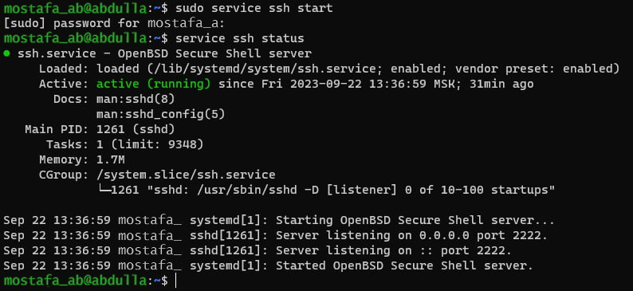
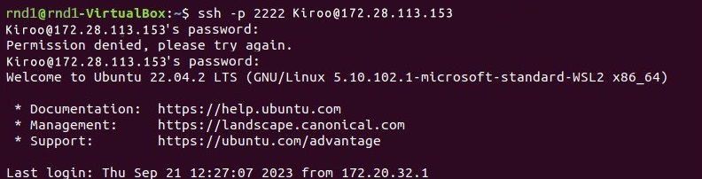
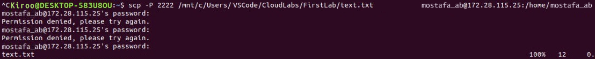
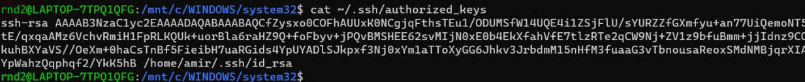

# Laboratory work No. 1

##1. Connect all 3 devices to a shared network. 

(As we are only two in the group, and all groups consist of four people, we will perform all the steps on two additional devices as well).

Two PCs equipped with WSL and one running a Linux OS (on a virtual machine) were employed for the task. All devices were connected to a shared Wi-Fi network, and all sharing settings, including file sharing for inter-device transfers, were enabled. The firewall in the Windows settings was also disabled.

The IP devices were located by utilizing the ipconfig command under the section labeled "Wireless LAN adapter Wireless network", specifically noting the line displaying the "IPv4 address" (refer to Figure 1).
The table provided below displays all the IP addresses.

|Device|IP|
|----------|--|
|PC A|172.28.114.254|
|PC B|172.28.113.153|
|PC C|172.28.115.25|

Using the ping IP command, we are verifying whether the computer can see the IP from the list (refer to Figure 2).

All three devices can communicate with each other, indicating that the connection to the local network has been successfully established.

##2. Configure WSL to accept connection requests to the server.

WSL 2 possesses a virtualized Ethernet adapter with its distinct IP address, identifiable through the ifconfig command in the WSL console. As connection requests originate from the Windows IP address, forwarding them to WSL is necessary. This action is performed in PowerShell (launched with administrator privileges) using the following command:

`netsh interface portproxy add v4tov4 listenaddress=0.0.0.0 listenport=2222 connectaddress=IP(X.X.X.X) connectport=2222`

**IMPORTANT!** In this command, you need to enter precisely the IP of the WSL 2 virtual machine. You can find it by accessing WSL and running `ifconfig`. In the `eth0` column, the `inet` item will display the required IP address.

The command establishes a port proxy server, awaiting data transmission on node port 2222, redirecting all connections to the WSL 2 virtual machine's port 2222 with the IP address X.X.X.X. Port 2222 is selected because certain public networks might block the standard port 22.

Using the `netsh interface portproxy show v4tov4` command, we check that the proxy server was successfully added (see Figure 3)

At the end, we configure the firewall rules using the command:

`netsh advfirewall firewall add rule name=”Open Port 2222 for WSL2” dir=in action=allow protocol=TCP localport=2222`

##3. Downloading and configuring the Openssh-server

Install the openssh-server using the command `sudo apt-get install openssh-server` if it's not already installed. Given that we modified the port to 2222, it's necessary to adjust it on the server as well. Since the server port is configured in the file, we can modify the configuration by using the command `sudo nano /etc/ssh/sshd_config`. Change the line `#Port 22` to `Port 2222` (ensure to delete the '#'), and save the configuration by pressing Ctrl + X, then Y, and finally Enter (refer to Figure 4).

Initiate the server using the command `sudo service ssh start`, or if it's already running, restart it with `sudo service ssh restart`. Following the port modification, it's essential to restart the server. Verify the server's activation status using the command `service sshd status` (refer to Figures 5-6). Some devices may display abbreviated messages indicating that the server is active.

## 4. Подключение к серверу по SSH и копирование файлов

To connect to the server via SSH, you'll require the username and IP (found earlier). To discover the username, simply enter the command `cat /etc/passwd` (refer to Figures 7-8). This command displays a comprehensive list of all users, unlike `whoami`, which shows the current user. If you specifically need the user you're currently logged in as, `whoami` will suffice.

PC user A - *rnd1* (no one)

PC User B - *Kiroo* (Kirollos)

PC user C - *mostafa_ab* (Mostafa)

Now all users are known and the user *rnd1* can connect to the user *Kiroo* on the PC B server. This is done using the command (see Figure 9):

`ssh -p 2222 username@ip`

Since we changed the port to 2222, we need to write `-p 2222` in the command (-p is case sensitive and it is necessary to write a small -p in the ssh command)

After connecting to the server on the PCB, we need to transfer the file to the PC to the C-user *mostafa_ab*. This is done using the command (see Figure 10):

`scp -P 2222 path1 username@ip:path2`

In this case, path1 is the path to the file of the user *Kiroo* on PC B, username is the user PC C *mostafa_ab*, ip PC C and path2 is the path to the folder to which the file will be copied (-P is also case-sensitive, in scp a capital -P is needed).

To check that everything was copied correctly, you can write the command `cat filename`, it will output the entire contents of the file to the console (see Figure 11-12).

## Task with an asterisk

To accomplish the task with an asterisk, you'll utilize the same devices and execute the same commands, but this time, we'll connect via an **SSH key**. This method allows you to access the server without entering a password. (Note: The IP has changed because tasks were performed on different days.)

|Device|IP|Name|
|----------|--|----|
|PC A (*rnd1*)|IP|172.20.10.6|
|PC B (*Kiroo*)|IP|172.20.10.4|
|PC C (*rnd2*)|IP|172.20.10.5|

First you need to create keys on the devices from which we will connect - PCE and PC B. This is done using the command `ssh-keygen`, just press Enter everywhere (see Figure 13-14)

To make sure that the key has been created, you need to enter the command `cat /etc/ssh/ssh_host_rsa_key.pub` - public keys and `sudo cat /etc/ssh/ssh_host_rsa_key` - private key (see Figure 15).

Next, we need to upload the keys to the server. We do this using the command `ssh-copy-id name@ip` and then we can log in to it without entering a password (see Figure 16). When copying the key, we are asked to enter the password, but later we will not need to do this.

Let's make sure that the keys have been uploaded to the server, you can do this using the command `cat ~/.ssh/authorized_keys'. We can also see who uploaded the key to the server (see Figures 17-18).

If we try to connect to the server or copy the file, we will still be asked to enter the password (see Figure 19)

In order for everything to work, you need to change the ssh config on the server. Open the config using `sudo nano /etc/ssh/sshd_config` and change the string **PasswordAuthication** from *yes* to *no*, also uncomment it (see Figure 20).

Then we do everything we did before. We connect from rnd1's PC to the Kiroo's server via ssh (see Figure 21). This time the password is no longer requested from us

The command is slightly different (`-i path` is added), we specify the path where the key for ssh is stored in order to understand what is needed for authentication on the server

Then we have to copy the file from Kiroo's PC to rnd2's PC. This time, nothing had to be redone, everything worked without errors. The key was not asked to be entered (see Figure 22)

Check if there is any file in the `la` directory. The file is found, which means the work is done (see Figure 23).

