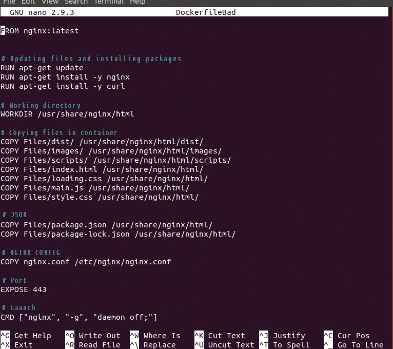
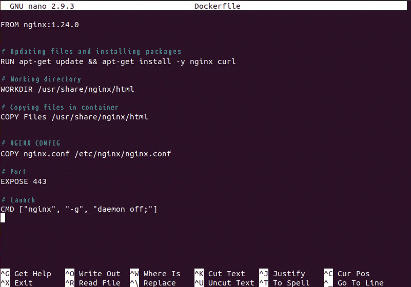
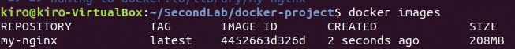
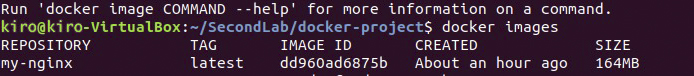
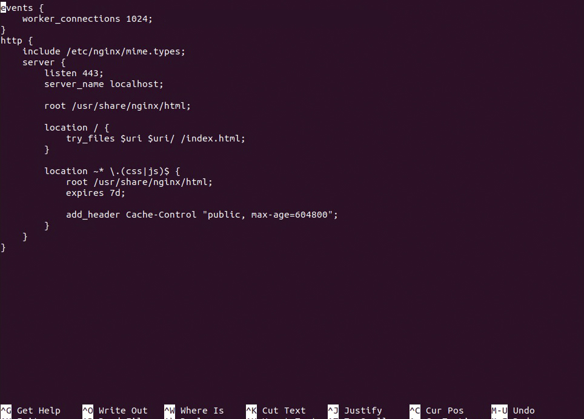
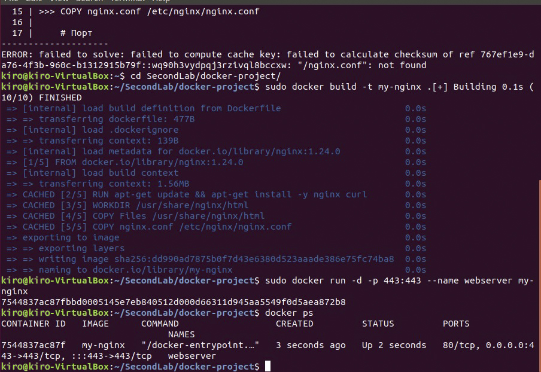
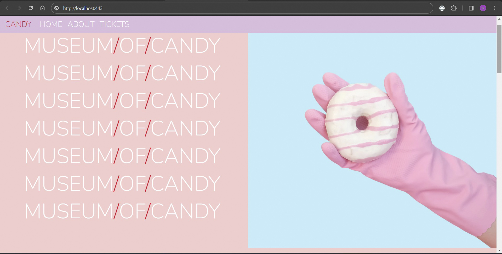

# Lab 2: Containerizing the Nginx Web Server Alongside Frontend Components (HTML, CSS, JS).

# Task
Create two Dockerfiles – one with poor practices and one with exemplary practices. The suboptimal version must initiate and function correctly, yet it should incorporate a minimum of three "suboptimal practices." Conversely, the improved Dockerfile must rectify these issues. The accompanying Readme elucidates all the inadequacies present in the Dockerfile code and provides a rationale for their shortcomings, elucidating how they were ameliorated in the superior Dockerfile. Additionally, the Readme outlines two shortcomings pertinent to utilizing this container.

Optional: Deploy a Kubernetes cluster (suitable choices include minikube or kind). Execute your containers within this cluster, ensuring comprehensive code documentation. The bare minimum entails configuring a deployment and service. Subsequently, an application housed within a container, nested within the cluster, should be accessible locally through your web browser.

## 1. Formulating a substandard Dockerfile (unsuitable).

The prevalent lapses in Dockerfile composition are evident:

Iterative application of the RUN command compounds both the image build duration and its overall size. This, in turn, amplifies the intricacy associated with debugging our image.

Repetitive deployment of the COPY directive engenders an escalation in image dimensions, resulting in the generation of numerous layers that impede the expeditious assembly process.

Adherence to the most recent NGINX version introduces the prospect of compatibility and security quandaries. The currency of the latest iterations does not invariably translate to stability, exposing the system to potential vulnerabilities.
   
## 2. Formulating a praiseworthy Dockerfile (suitable).

Adhering to commendable practices in Dockerfile construction:

- Adopts a precise and steadfast version of NGINX to ensure stability.
- Consolidates file updates and package installations into a single command line for efficiency.
- Specifies the working directory for commands executed within the container during initialization.
- Transfers files using a singular command, avoiding individual file copying for streamlined operations.
- Implements Docker ignore to expedite the build process and diminish image size, particularly beneficial in our context for excluding non-client-affecting JSON files.
- Annotates each code segment comprehensively to augment code legibility and maintainability.

## 3. Comparing the sizes of the docker images obtained after assembly.
"Unsuitable"

"Suitable"

Evidently, crafting a Dockerfile with precision can yield memory savings of approximately 20% or more, concurrently optimizing time efficiency.

## 4. Configuring our NGINX web server:
- Augment the count of concurrent connections within the EVENTS block.
- Mandatory activation of Mime type support.
- Configure server listening on port 443.
- Establish the primary directory for the administration of our web assets.
- Implement handling for CSS and JS files, incorporating resource caching.

## 5. Building and run a container with a web server.

In the web browser, we initiate a request to localhost:443 and revel in the functionality of our operational site! All static files function seamlessly, buttons respond to clicks, and the site permits actions such as adding books to the cart and seamless navigation.

## Website Info:
"If you are interested in exploring the website further, follow this link to an entirely different repository housing the complete project, including a hosted link inside: [Check it out](https://github.com/Kirollos-Rezkallah/Museum-of-Candy)"
