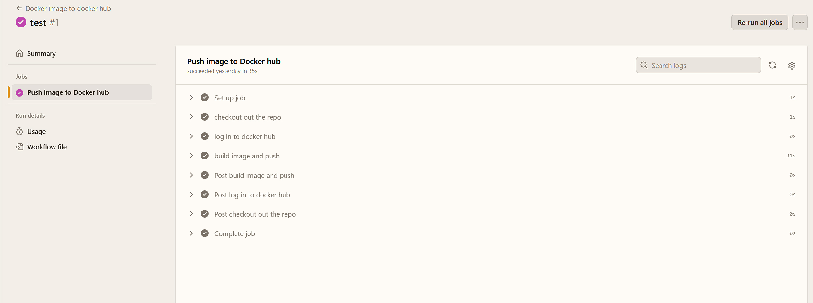
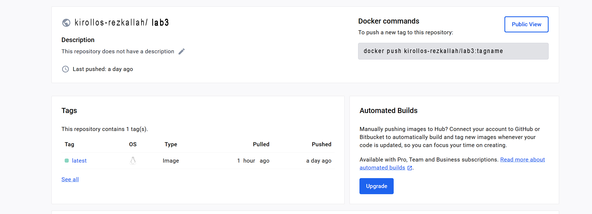

# Lab 3

# Task
Ensure that post-push, the Docker image undergoes automatic compilation within your repository, and the resultant build outcome is persistently stored. This could involve automated storage on the local machine, within your repository, or on a designated server, such as encapsulating the result in a text file for archival purposes.

## 1. We employ a pre-existing repository containing a Vanilla JS-based website. [*Click here*](https://github.com/Kirollos-Rezkallah/Museum-of-Candy)


## 2. Compose a YAML file to facilitate the automated construction of a Docker image and subsequently store its output on DockerHub.

```
name: Docker image to docker hub

on: 
  push:
    branches:
      - 'main'
jobs:
  push_to_docker_hub:
    name: Push image to Docker hub
    runs-on: ubuntu-latest
    steps:
      - name: checkout out the repo 
        uses: actions/checkout@v4
      
      - name: log in to docker hub 
        uses: docker/login-action@v3
        with:
          username: ${{ secrets.DOCKER_USER }}
          password: ${{ secrets.DOCKER_PASSWORD }}

      - name: build image and push
        uses: docker/build-push-action@v5
        with:
          context: .
          push: true
          tags: kirollos-rezkallah/lab3_test:latest
```

## 3. Initiate the startup process and patiently await the thorough examination of the tests.



## 4. Verifying the presence of the image on DockerHub.




### All tasks have been accomplished successfully. 


